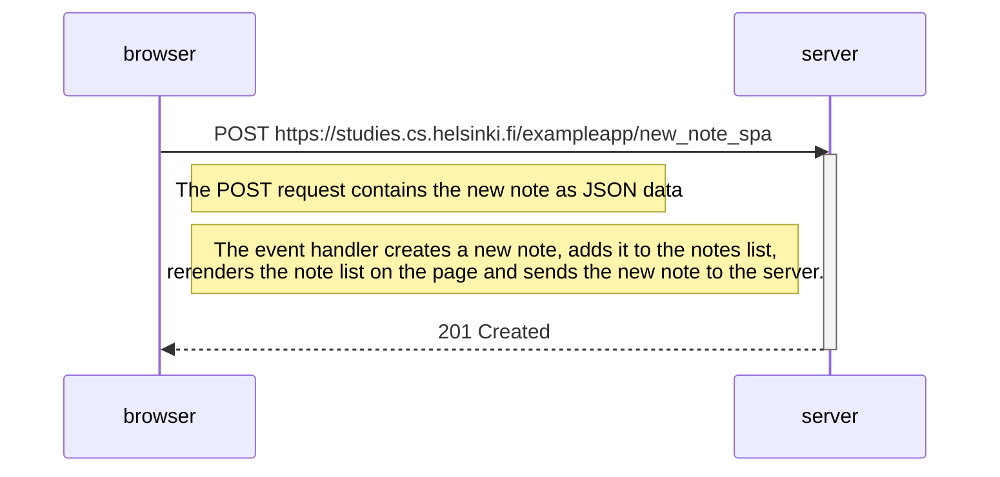

```mermaid
sequenceDiagram
    participant browser
    participant server

    browser->>server: POST https://studies.cs.helsinki.fi/exampleapp/new_note_spa
    activate server
    Note right of browser: The POST request contains the new note as JSON data
    Note right of browser: The event handler creates a new note, adds it to the notes list, <br> rerenders the note list on the page and sends the new note to the server.
    server-->>browser: 201 Created
    deactivate server
```